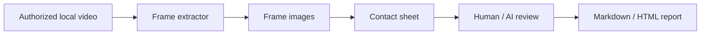

# Architecture

```text
douyin-local-video-lab/
  scripts/
    douyin-download.js       # Legacy authorized-source resolver
    extract-frames.js        # Local MP4 key-frame extraction
    make-contact-sheet.js    # Local HTML contact sheet generator
    open-demo.js             # Opens static demo pages
    validate-demo.js         # Checks demo and sample-data structure
  extension/
    edge-video-downloader/   # Authorized direct-video helper extension
  docs/
    compliance.md            # Acceptable use and privacy boundaries
    monetization.md          # Commercial MVP plan
    roadmap.md               # Product roadmap
  web-demo/
    index.html               # Static product page
    demo-report.html         # Fictional sample report
    styles.css               # Shared demo styling
  examples/
    sample-report-data.json  # Fictional demo report data
```

## Components

| Component | Input | Output | Role |
|---|---|---|---|
| `extract-frames.js` | Local authorized MP4 | PNG frames and `frames.json` | Samples visual evidence from local material. |
| `make-contact-sheet.js` | Frame directory | `contact-sheet.html` | Builds a review-friendly visual overview. |
| `open-demo.js` | Static demo files | Browser tabs | Opens the product page and sample report. |
| `validate-demo.js` | Demo HTML and JSON | Check result | Prevents broken showcase files. |
| `douyin-download.js` | Authorized source link, ID, or playable URI | Local MP4 | Legacy resolver kept for lawful sources only. |
| Browser helper extension | Current tab with direct HTML5 video | Browser download task | Saves direct videos only when the user has rights. |

## Technical Notes

- Node.js streams handle large local files without reading them into memory.
- A temporary local HTTP Range server lets the browser seek through local MP4 files.
- Playwright plus Edge/Chromium performs seek, pause, and screenshot operations.
- The static web demo has no backend and can be opened directly from disk.
- The extension uses Chrome Extensions Manifest V3 APIs and does not bypass protected streams.

## Data Flow



## Why Generated Files Are Not Committed

Videos, key frames, browser caches, and local reports may contain copyrighted material, private client content, or personal browsing data. The repository keeps source code, documentation, and fictional demos only. Generated files belong in ignored folders such as `downloads/` and `artifacts/`.
